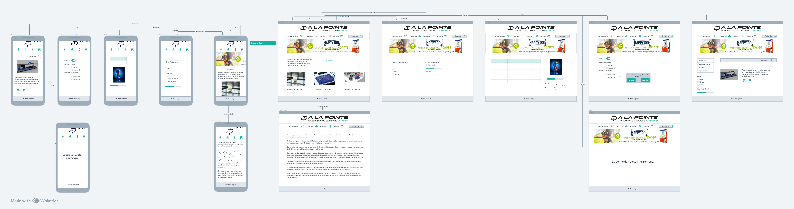

# À la Pointe - Application Mobile

Application mobile Flutter pour la société A la pointe.

## Table des Matières

- [À Propos](#à-propos)
- [Fonctionnalités](#fonctionnalités)
- [Captures d'Écran (Optionnel)](#captures-décran-optionnel)
- [Prérequis](#prérequis)
- [Installation](#installation)
- [Utilisation](#utilisation)
- [Structure du Projet](#structure-du-projet)
- [Navigation](#navigation)
- [Dépendances Clés](#dépendances-clés)
- [Contribution (Optionnel)](#contribution-optionnel)
- [Licence (Optionnel)](#licence-optionnel)
- [Contact (Optionnel)](#contact-optionnel)

## À Propos

Application mobile Flutter pour gérer des capteurs ESP32 connectés en Bluetooth fonctionnant
comme cibles pour l'entraînement à l'escrime.L'application gère la connectivité Bluetooth et
permet d'afficher les données reçues par les capteurs, elle renvoie vers les cibles un 
programme d'entraînement au choix parmi quatre.

## Fonctionnalités

Listez les principales fonctionnalités de l'application :

*   **Accueil :** Navigation principale et accès aux différentes sections.
*   **Gestion des Entraînements :**
    *  4 programmes différents
    *  Initiation
    * Loisir
    * Performeur
    * Série
    * Un mode silencieux
*   **Visualisation des Résultats :**
    *  Récupération de l'UUID par Bluetooth.
    *  Affichage des données via des graphiques.
*   **Connectivité Bluetooth :**
    *   Activation directe du Bluetooth (Android) , redirection vers les réglages (IOS).
    * Affichage des appareils connectés et ceux disponibles.
    * Déconnexion.
*   **Boutique en Ligne :**
    *   Redirection vers la boutique web `https://www.a-la-pointe.fr/shop`]
*   **Mentions Légales :**
    *   Accès aux termes et conditions via `https://www.a-la-pointe.fr/terms`
*   **Publicité :**
    *   Utilisation de Google AdMob pour l'affichage de publicité.

## Captures d'Écran 

